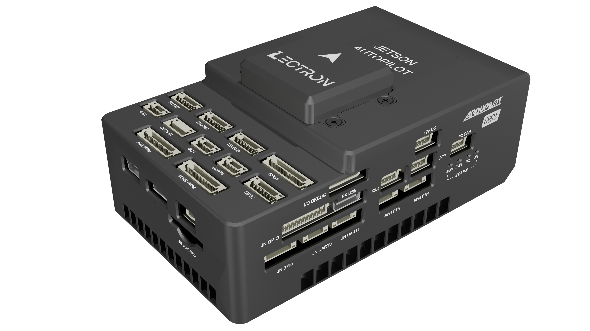

# Lectron Jetson Flight Controller

The Lectron Jetson is a flight controller produced by [Lectron](https://lectrontech.com/).

The [Lectron Jetson](https://lectronuser.github.io/Lectron-Doc-Center/md/jetson/) is designed as an integrated flight control and computing platform for autonomous systems and advanced embedded applications. The hardware architecture consolidates real-time flight control and high-level computing into a single unified board.

This approach simplifies system integration, reduces cabling complexity, and improves overall system reliability.

## Features

- DF40C Connectivitiy with Pixhawk Jetson Standard Pinout

- Processors
  - STM32H753 480Mhz,
  - 2MB  flash memory
  - 32-bit processor

- Onboard Sensors
  - ICM42670P IMU(SPI)
  - Bosch BMP390 Barometers(I2C)

- Sensor Board Sensors
  - ICM42670P IMU(SPI)
  - Bosch BMI270 IMU(SPI)
  - Bosch BMP390 Barometers(I2C)
  - Bosch BMM350 Magnetometer(I2C)

- Serial Interfaces x8 (UART MAPPING)
  - USART1  : GPS-1           : GPS, Mag, Buzzer, Safety Switch In and Led Out
  - USART2  : Telemetry-3     : Companion Communication with Hardware level Flow control
  - UART3   : FMU DEBUG       : Fmu Debug Port
  - UART4   : UART4 & I2C3    : External Connection
  - UART5   : Telemetry-2     : External Connection with Hardware level Flow control
  - USART6  : IO Chip         : F103 IO Chip Communication
  - UART7   : Telemetry-1     : External Connection with Hardware level Flow control
  - UART8   : GPS-2           : GPS, Mag

- RC Interferances
  - Sbus Input & Output Supported
  - RSSI Input Supported
  - PPM Input Supported
  - DSM Input Supported

- Power Requirement
  - **Input Voltage:** 4.8-5.6VDC Input

- Other Supported Interferance
  - Micro SD
  - 8 x PWM(Dshot Capable) FMU(AUX) Outputs
  - 2 x CAN
  - 100-MBPS Supported RMII Connection

## Fully Supported Frame With Lectron Jetson Autopilot

Lectron Jetson Autopilot designed and manufactured by [Lectron](https://lectrontech.com/)

The [Lectron Jetson Autopilot](https://lectronuser.github.io/Lectron-Doc-Center/md/jetson/) is designed as an integration for Pixhawk Jetson based flight controller and Jetson series computing platform. The Lectron Jetson Autopilot Supports both modules and their external connections.

### Lectron Jetson Autopilot Features

#### Flight Controller Part with Lectron Jetson FC

- F103 IO chip integration
- Telemetry-1
- Telemetry-2
- Telemetry-3 (Default Bridged to Jetson Uart)
- 1x Can
- 100-Mbps Ethernet Connection
- Seperated Uart4-I2C3 Connection
- SBUS Input/Output Support
- RSSI Input Support
- PPM  Input Support(DSM Not Supported)
- FULL Gps with Magnetometer, Buzzer, Safety Led and Switch
- Basic Gps with Magnetometer
- 8x Dshot Capable PWM (FMU-AUX)
- 8x PWM (IO-MAIN)
- USB 2.0 Type-C

#### Companion Computing Part with Jetson Nano/Xavier

- Level Shifter mechanism for 3.3Vdc GPIO Acces
- 2x CSI Camera Interface
- UART-0, UART1, UART2(Debug Uart)
- I2C-1, I2C-2
- 100-Mbps Ethernet Connection
- 1x SPI
- 1x CAN(SPI Interfaced)
- FRCV and Reset Buttons
- Micro SD
- 1x USB 3.0 Type-C
- 1x USB 2.0 Type-B Mini(Debug USB)

#### Lectron Jetson Autopilot's Other Features

##### Power Architecture

- **System input** : 12-26VDC (4-6S Li-Po)
- **Power Features** : Reverse Polarity Protection, Seperated Regulation Buses, INA238 onboard voltage sensing
- **FMU Power Regulation** : Seperated 5V-3A Power Bus
- **Companion Power Regulation** : Seperated 5V-5A Power bus with high capacitance Tantal Capacitors

##### Ethernet Architecture

- Lectron Jetson Autopilot includes onboard ethernet switch structer. Both FMU and Companion computer defaultly connected.
- **Ethernet Switch IC** : KSZ8795, 4x PHY with 100-Mbps Connection(System does not includes inbuild pulse transformer)
- **External Connectivity** : 2x 4-Pin JST-GH Connector each supports 100-Mbps connection to both FMU and Companion Computer.

## Loading Firmware

Firmware can uploaded by following the given instructers in [here](https://lectronuser.github.io/Lectron-Doc-Center/md/jetson/setup/#fmu-firmware-installation). This steps provided and tested by Lectron.

## See Also

- [Lectron Jetson Autopilot](https://lectronuser.github.io/Lectron-Doc-Center/md/jetson/) (Lectron)
- [Pinout and Details](https://lectronuser.github.io/Lectron-Doc-Center/md/jetson/pinout/)
