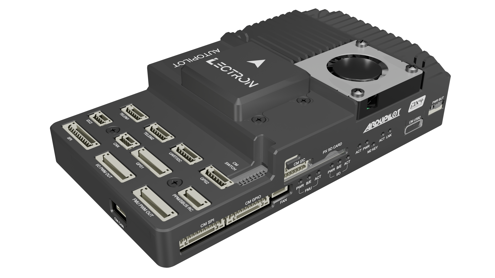

# Lectron Pi5 Autopilot Flight Controller

The Lectron is a flight controller produced by [Lectron](https://lectrontech.com/).

The [Raspberry CM5 Board](https://lectronuser.github.io/Lectron-Doc-Center/md/raspberry/) is designed as an integrated flight control and computing platform for autonomous systems and advanced embedded applications. The hardware architecture consolidates real-time flight control and high-level computing into a single unified board.

This approach simplifies system integration, reduces cabling complexity, and improves overall system reliability.

## Features for FMU Part

- Processors
  - STM32H753 480Mhz,
  - 2MB  flash memory
  - 32-bit processor

- Onboard Sensors
  - ICM42670P IMU(SPI)
  - Bosch BMP390 Barometers(I2C)

- Sensor Board Sensors
  - ICM42670P IMU(SPI)
  - Bosch BMI270 IMU(SPI)
  - Bosch BMP390 Barometers(I2C)
  - Bosch BMM350 Magnetometer(I2C)

- Serial Interfaces x8 (UART MAPPING)
  - USART1  : GPS-1           : GPS, Mag, Buzzer, Safety Switch In and Led Out
  - USART2  : Telemetry-3     : Companion Communication with Hardware level Flow control
  - UART3   : FMU DEBUG       : Fmu Debug Port
  - UART4   : UART4 & I2C3    : External Connection
  - UART5   : Telemetry-2     : External Connection with Hardware level Flow control
  - USART6  : IO Chip         : F103 IO Chip Communication
  - UART7   : Telemetry-1     : External Connection with Hardware level Flow control
  - UART8   : GPS-2           : GPS, Mag

- RC Interferances
  - Sbus Input & Output Supported
  - RSSI Input Supported
  - PPM Input Supported
  - DSM Input NOT Supported

- Micro SD
- F103 IO chip integration
- Telemetry-1
- Telemetry-2
- Telemetry-3 (Default Bridged to RPI Uart)
- 1x Can
- 100-Mbps Ethernet Connection
- Combined Uart4-I2C3 Connection
- I2C2 External Connection
- SPI6 with 2x CS and 2x DRDY
- SBUS Input/Output Support
- RSSI Input Support
- PPM  Input Support(DSM Not Supported)
- FULL Gps with Magnetometer, Buzzer, Safety Led and Switch
- Basic Gps with Magnetometer
- 8x Dshot Capable PWM (FMU-AUX)
- 8x PWM (IO-MAIN)
- USB 2.0 Type-C
- FMU & IO Debug Ports

## Companion Computer Part With RPI Compute Module-5

- 2x CSI Camera Interface
- 1x Power Button
- 8-Pin 1-Gbps capable ethernet port
- I2C-1 & I2C-3 Combined Port
- UART2 & 6x Gpio Combined Port
- SPI1 & 4x Pwm Combined Port
- 4-Pin JST-SRSS Fan Port(Tacho included)
- 1x CAN(SPI Interfaced)
- Micro Hdmi
- 2x USB 3.0 Type-C
- Dip Switch Mechanism for General Usage
- M2 M-Key 2230/2242 Support for SSD or AI Accelerator

## Power Architecture

- **System input** : 12-26VDC (4-6S Li-Po)
- **Power Features** : Reverse Polarity Protection, Combined Regulated Bus, INA238 onboard input voltage sensing

## Loading Firmware

Firmware can uploaded by following the given instructers in [here](https://lectronuser.github.io/Lectron-Doc-Center/md/raspberry/setup/#fmu-firmware-installation). This steps provided and tested by Lectron.

## See Also

- [Raspberry CM5 Board](https://lectronuser.github.io/Lectron-Doc-Center/md/raspberry/) (Lectron)
- [Pinout and Details](https://lectronuser.github.io/Lectron-Doc-Center/md/raspberry/pinout/)
